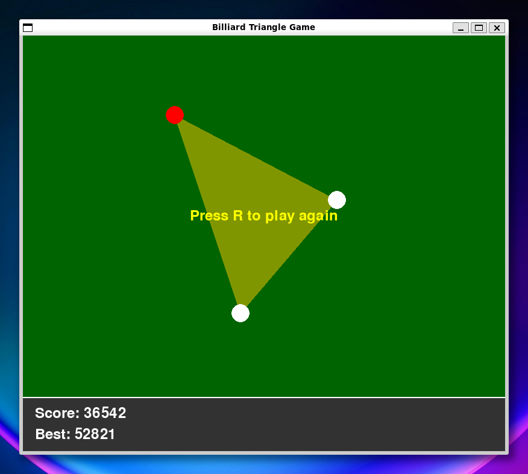

# Billiard Triangle Game

Amazon Q CLIを使って開発した、シンプルながら奥深いビリヤード風三角形ゲームです。



## 概要

このゲームは、ビリヤードのような物理法則に基づいた球の動きを楽しみながら、最終的に3つの球で作られる三角形の面積を競うシンプルなゲームです。

1. 赤い的球が盤面にランダムに配置されます
2. プレイヤーは2つの白い手玉を順番に配置します
3. 手玉は的球に向かって自動的に動き出します
4. 球同士の衝突や壁での跳ね返りが物理法則に従って計算されます
5. 最終的に3つの球（赤球と2つの白球）で作られる三角形の面積がスコアになります

## 遊び方

1. 左クリックで白い手玉を配置します
2. 手玉は自動的に赤い的球に向かって動き出します
3. 球が止まったら、2つ目の手玉を配置します
4. 3つの球が作る三角形の面積がスコアになります
5. Rキーで新しいゲームを開始します
6. ESCキーでゲームを終了します

## 戦略のヒント

- 壁を利用して複雑な軌道を作ると、予想外の位置に球が止まることがあります
- 盤面の隅に球を集めると、大きな三角形ができやすくなります
- 1球目と2球目の配置を工夫して、最大の三角形を作りましょう

## 必要環境

- Python 3.6以上
- Pygame

## インストール方法

```bash
# 必要なライブラリをインストール
pip install pygame
```

## 実行方法

```bash
python billiard_triangle.py
```

## 開発背景

このゲームはAmazon Q CLIを使って開発されました。AIアシスタントとの対話を通じて、アイデアの具現化からバグ修正まで行いました。シンプルなコンセプトから始まり、プレイ感覚の調整を重ねて完成させました。

## ライセンス

MITライセンスの下で公開されています。詳細は[LICENSE](LICENSE)ファイルをご覧ください。
